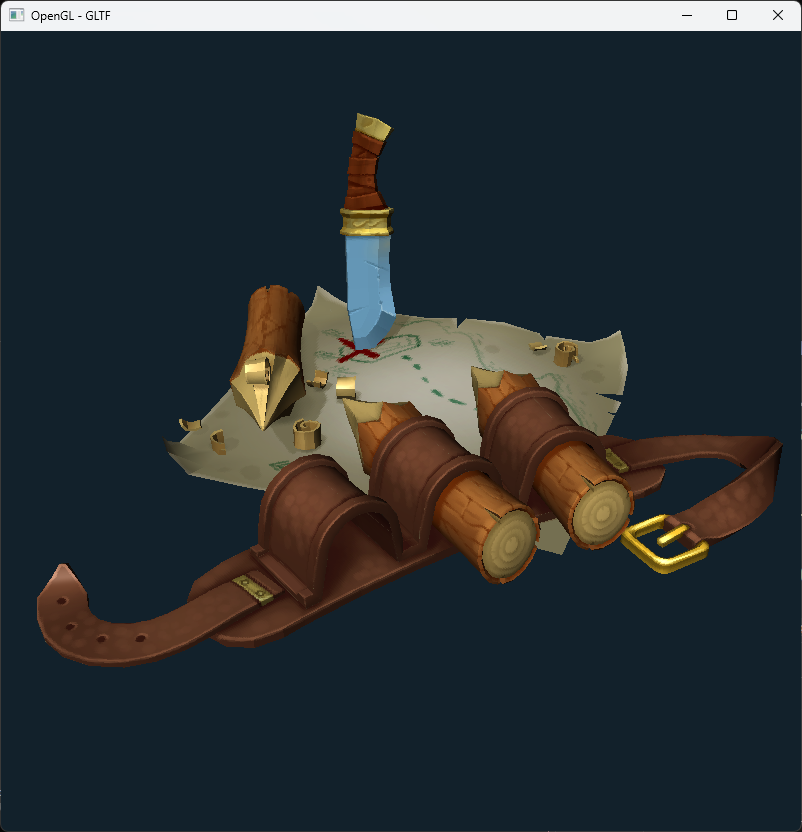

# OpenGL 3D Model Viewer



## Opis
OpenGL 3D Model Viewer to aplikacja umożliwiająca wyświetlanie modeli 3D w formacie glTF w trójwymiarowej scenie. Pozwala na łatwe i efektywne przeglądanie modeli 3D i ich wizualizację w czasie rzeczywistym.

## Biblioteki
Projekt korzysta z następujących bibliotek:
- **glad**: Inicjalizuje OpenGL i zapewnia dostęp do funkcji OpenGL.
- **GLFW**: Zarządza oknami, wejściami i kontekstem OpenGL.
- **glm**: Biblioteka matematyczna do operacji na wektorach i macierzach, niezbędna do grafiki 3D.
- **json**: Parsuje dane w formacie JSON, używane do wczytywania konfiguracji lub innych danych.
- **KHR**: Rozszerzenia do formatu glTF, zapewniające dodatkowe funkcjonalności.
- **stb**: Narzędzia do wczytywania tekstur w różnych formatach, takich jak PNG, JPEG, czy BMP.

## Jak zacząć
1. Sklonuj repozytorium:
   ```bash
   git clone https://github.com/RolbaDev/Opengl-3D-Model-gltf.git
